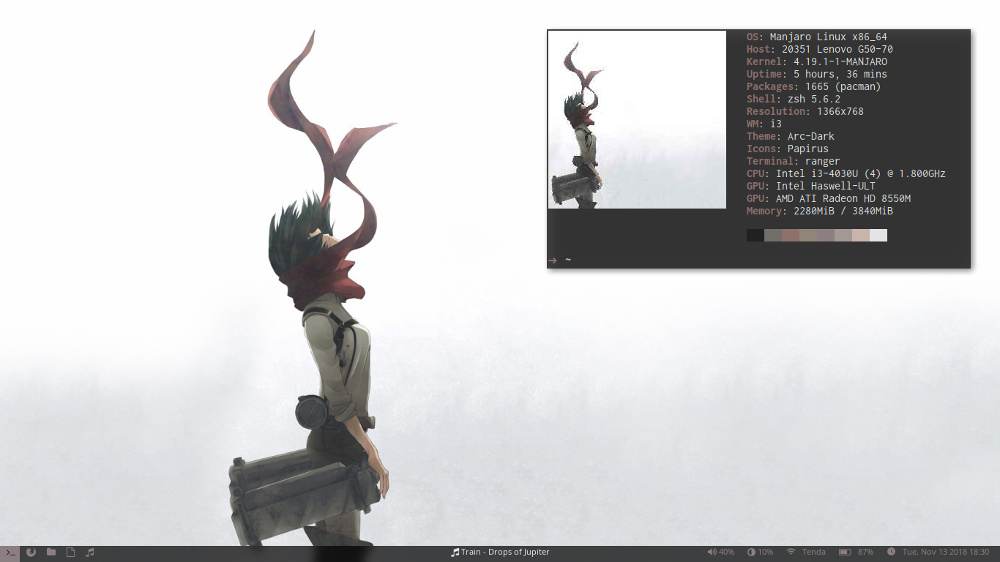
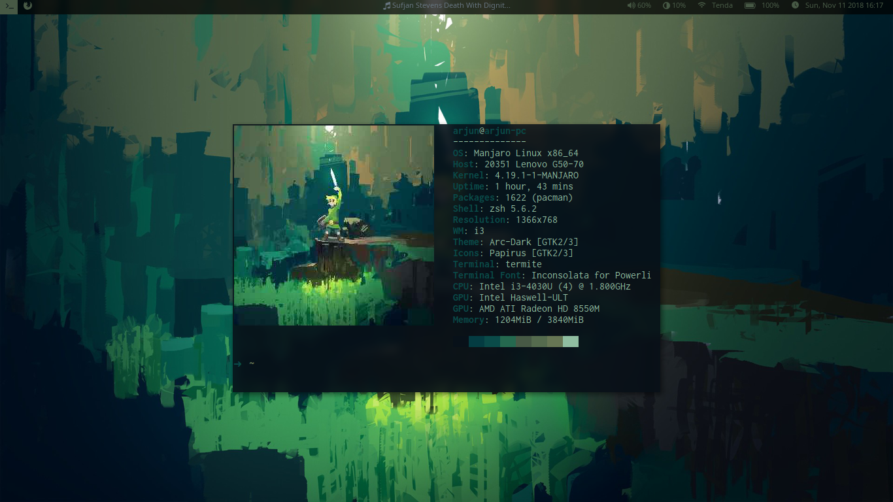
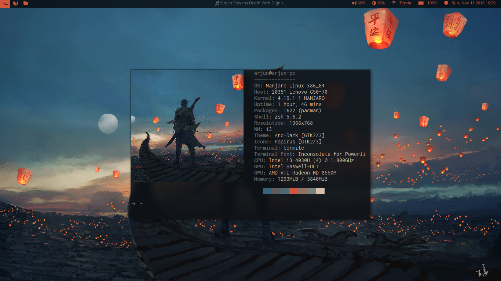
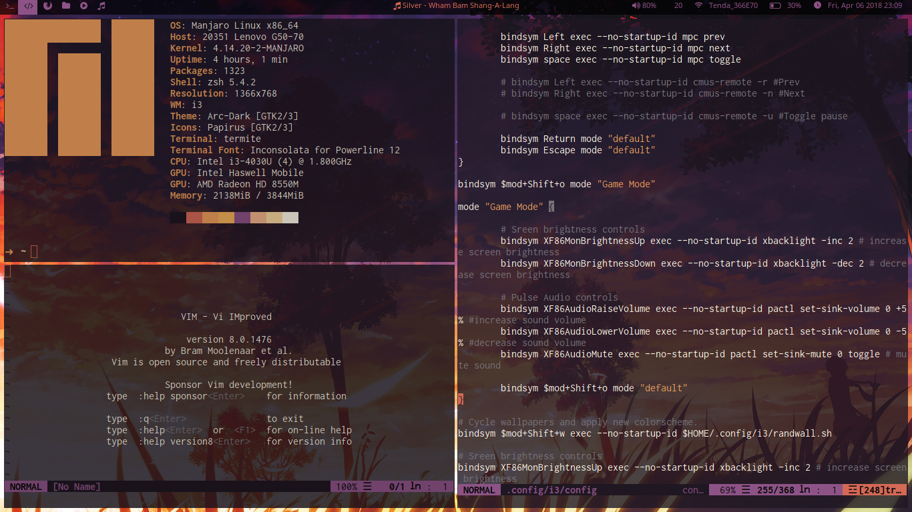
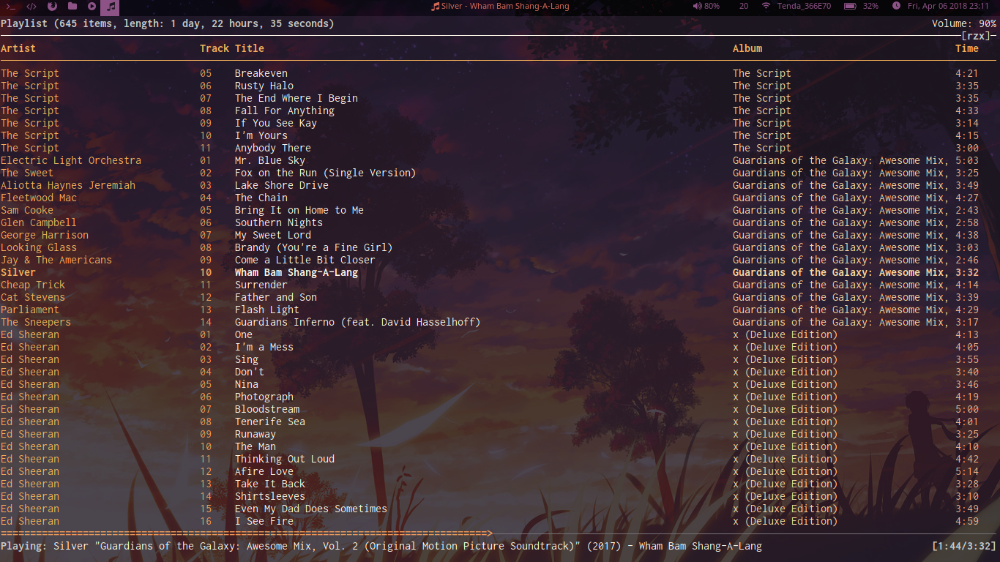

# Dotfiles
The behind the scenes config files of what runs on my Linux system.

I use Manjaro linux, a variant of Arch linux. I've been a long time i3 user but now I use KDE as it suits my current workflow more. I explain more about my DE choices later.

Most of the applications used are only in i3 only.

## i3-gaps
10 Workspaces:
 1. Shell
 2. Coding,
 3. Browsers,
 4. File manager,
 5. Documents,
 6. Games,
 7. Media,
 8. IRC chat,
 9. Extra bin,
 10. Music

Windows go to their workspaces automatically so easy to find any window in an instant.
Wallpaper and overall colorscheme controlled using pywal.

 - Bottom bar - Polybar
 - Application launcher - rofi
 - Terminal - termite
 - Browser - qutebrowser
 - File manager - ranger
 - Document viewer - zathura
 - Games - Steam
 - Media player - mpv/vlc
 - IRC client - HexChat
 - Music player - (not used now) cmus + mpd
 - Lockscreen - betterlockscreen

Special modes in i3:
 - Game Mode - disable all key binding for no interference,
 - Music mode - for quick music controls using keyboard only from anywhere.

There are more special stuff, if interested you can go through [i3 config](config/i3/config). It's pretty well documented.

## Shell
I use zsh with oh-my-zsh. Default robbyrussell theme looks good and minimal for my liking. Nothing special here.

## Scripts
The folder was inspired and started from Luke Smith's dotfiles.

 - btmenu - Connect with bluetooth devices using rofi as interface.
 - compiler - Compile any file based on the type of the file.
 - dmenumount - dmenu interface for mounting disks.
 - dpass - dmenu interface to type password.
 - opout - Run any file based on type of the file.
 - shortcuts.sh - Add the configs and folders shortcuts to shell and ranger
 - utility - Master interface for bluetooth and wifi menu using rofi.

## Ranger
A console file manager with vim key bindings. I have additional shortcuts for quick access to my main folders. The shortcuts script helps create this automatically.

Example, to **g**o to my **w**orks folder just press **gw** and similar.

## Polybar

## Rofi
Application launcher for i3. My own theme :D

## Vim
Vim Plug for plugins

| Package        | Description                                             |
| --             | --                                                      |
| YouCompleteMe  | Pretty cool autocomplete                                |
| emmet-vim      | Emmet snippets for web                                  |
| goyo.vim       | Beautiful distraction less mode for writing             |
| syntastic      | Syntax and code checker                                 |
| tcomment_vim   | File type based auto comment                            |
| wal.vim        | Wal colorscheme according to wallpaper                  |
| vim-airline    | For cooler status bar                                   |
| vim-easyescape | Press jk or kj to quick escape                          |
| vim-easymotion | Quick move to anywhere on screen                        |
| vim-gitgutter  | git integration for showing changed lines               |
| vim-repeat     | For supporting surround repeats                         |
| vim-surround   | Easier surrounding brackets or quotes and stuff editing |

Some other custom stuff:
 - opout and compiler script shortcuts for easy compile and running files from vim itself.
 - Guide marker(`<++>`) for easy and quick navigation
 - Lots of custom snippets using the markers for easy code.

## Emacs
Plugins used:

| Package         | Description                                               |
| --              | --                                                        |
| ace-jump-mode   | Quickly move anywhere in screen in couple of key presses  |
| cmake-mode      | Sets up stuff nicely with cmake                           |
| company         | Nice autocomplete                                         |
| evil            | Vim on emacs                                              |
| evil-goggles    | A visual cue on area affected by area command. Aesthetics |
| evil-surround   | Similar to vim-surround in emacs evil                     |
| evil-visualstar | Pressing * or # searches visual selection                 |
| flycheck        | Syntax checker                                            |
| grip-mode       | Github flavour markdown preview                           |
| magit           | Super powerful git in emacs                               |
| markdown-mode   | Markdown support for emacs                                |
| telephone-line  | Powerline for emacs                                       |
| undo-tree       | Much easier undo implementation                           |
| whiteroom-mode  | Similar to Goyo for Vim, beauty writing mode              |

There are a lot of custom changes, here are a few:
 - Windmove for quick movement between windows
 - Keymappings for hybrid evil mode working.(Default emacs keybindings work when in insert mode)
 - winner-mode for saved window configs
 - org-mode for tasks(don't use them now though)

## Screenshots

